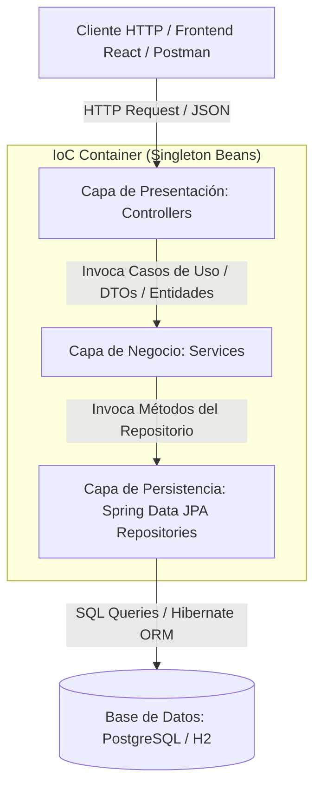
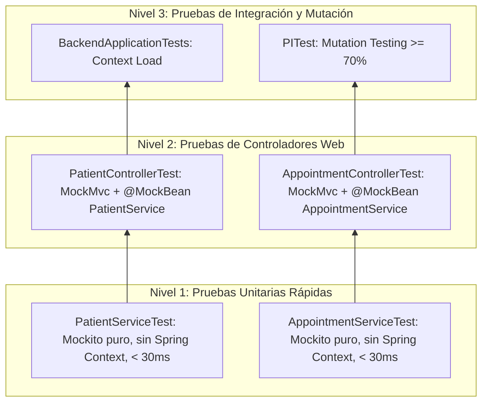

# RPD-001: Adopción e Implementación de Arquitectura en Capas, Patrón Repository con Spring Data JPA y Gestión de Ciclo de Vida Singleton en DermaCare Backend

**Registro de Decisiones de Proyecto (RPD / Architecture Decision Record)**  
- **Identificador:** RPD-001  
- **Fecha:** 22 de Septiembre de 2026  
- **Estado:** Aprobado e Implementado  
- **Contexto:** DermaCare — Sistema de Gestión Dermatológica (`backend/`, Spring Boot 3.2.5 / Java 17)  
- **Cátedra:** Ingeniería del Software II  

---

## 1. Contexto del Problema y Diagnóstico Inicial

### 1.1 Diagnóstico de la Situación Previa
Al inspeccionar la estructura del backend en `backend/src/main/java/com/dermacare/backend/`, se constató la siguiente anomalía estructural:
1. El paquete `services/` se encontraba completamente vacío.
2. Los controladores REST (`PatientController` y `AppointmentController`) inyectaban de manera directa las interfaces de persistencia `PatientRepository` y `AppointmentRepository`, puenteando por completo la capa de negocio.
3. Las pruebas automatizadas de los controladores (`PatientControllerTest`, `AppointmentControllerTest`) estaban acopladas a la base de datos (H2 en memoria y `EntityManager`), requiriendo inserciones directas de entidades en base de datos para verificar simples contratos de transporte HTTP.

### 1.2 Riesgos e Impactos Negativos del Acoplamiento Directo (Controller $\to$ Repository)
- **Violación del Principio de Responsabilidad Única (SRP):** Los controladores asumían la responsabilidad de gestionar peticiones HTTP y, al mismo tiempo, orquestar directamente el acceso a datos.
- **Falta de Encapsulamiento de la Lógica de Negocio:** Toda regla de validación de invariantes (e.g., validar que el DNI no sea nulo, verificar existencia previa, o asignar estados predeterminados) quedaba forzada a ubicarse en el controlador o quedaba omitida, propagándose datos inválidos hacia la base de datos.
- **Vulnerabilidad Transaccional:** La demarcación transaccional (`@Transactional`) no existía a nivel de negocio. El manejo de transacciones quedaba delegado al comportamiento por defecto de Spring Data o al antipatrón *Open Session in View*, aumentando el riesgo de bloqueos de conexión y condiciones de carrera.
- **Pobreza en la Pirámide de Pruebas:** No era posible escribir pruebas unitarias puras y veloces de la lógica de negocio; cada prueba de controlador se convertía obligatoriamente en una prueba de integración pesada con base de datos.

---

## 2. Decisión Arquitectónica: Arquitectura en Capas (Layered Architecture)

Para resolver estos problemas y establecer una base extensible y mantenible, se adopta formalmente la **Arquitectura en Capas Estricta (Layered Architecture)** dividida en tres estratos claramente delimitados:



### 2.1 Desglose de Responsabilidades por Capa

#### A. Capa de Presentación (`com.dermacare.backend.controllers`)
- **Propósito:** Actuar como adaptador primario de entrada al sistema (frontera web).
- **Responsabilidades exclusivas:**
  - Exposición de endpoints REST mediante `@RestController` y `@RequestMapping`.
  - Mapeo y deserialización de payloads JSON (`@RequestBody`) a objetos Java.
  - Validación sintáctica de peticiones y control de acceso/seguridad HTTP (validación de tokens JWT mediante `JwtAuthenticationFilter`).
  - Retorno de códigos de estado HTTP estandarizados (200 OK, 201 Created, 400 Bad Request, 401 Unauthorized, 403 Forbidden, 404 Not Found).
- **Restricción arquitectónica:** Los controladores tienen **prohibido** interactuar con repositorios o bases de datos; se comunican únicamente con la capa de servicios.

#### B. Capa de Lógica de Negocio / Servicios (`com.dermacare.backend.services`)
- **Propósito:** Núcleo de las reglas del dominio y orquestación de casos de uso.
- **Responsabilidades exclusivas:**
  - Encapsular todas las reglas de negocio, invariantes y validaciones de datos (e.g. validación de obligatoriedad de campos críticos como DNI, nombre, apellido, o asignación de estados predeterminados en citas).
  - Gestionar la demarcación transaccional declarativa (`@Transactional` a nivel de método/clase, con `@Transactional(readOnly = true)` en consultas de lectura para optimizar el rendimiento del EntityManager).
  - Coordinar la interacción entre múltiples repositorios o servicios externos (e.g. Mercado Pago, notificaciones).
- **Aislamiento:** La capa de servicios es agnóstica del protocolo de transporte; no depende de clases HTTP (`HttpServletRequest`, `ResponseEntity`, etc.), lo que permite que sea consumida indistintamente por controladores REST, tareas programadas (schedulers) o consumidores de colas de mensajería.

#### C. Capa de Persistencia / Acceso a Datos (`com.dermacare.backend.repositories`)
- **Propósito:** Abstracción del almacenamiento y recuperación de datos de las entidades de dominio.
- **Responsabilidades exclusivas:**
  - Declaración de contratos de persistencia mediante interfaces de Spring Data JPA (`JpaRepository<T, ID>`).
  - Aislamiento de dialectos SQL y del motor relacional subyacente (PostgreSQL en producción, H2 en entornos de pruebas).
  - Ejecución eficiente de operaciones CRUD, paginación, ordenamiento y consultas derivadas o JPQL.

---

## 3. Comparativa Crítica y Justificación: Spring Data JPA (Repository Pattern) vs DAO Tradicional (`IClienteDao` / `ClienteDaoImpl`)

Uno de los debates recurrentes en la ingeniería de software empresarial es la elección entre el patrón tradicional **DAO (Data Access Object)** y el patrón **Repository** implementado de forma declarativa con **Spring Data JPA**.

### 3.1 Tabla Comparativa

| Dimensión | DAO Tradicional (`IClienteDao` + `ClienteDaoImpl`) | Spring Data JPA (`PatientRepository`) |
| :--- | :--- | :--- |
| **Estructura de Clases** | Requiere una interfaz (`IClienteDao`) y una clase concreta de implementación (`ClienteDaoImpl`). | Únicamente se declara una interfaz que hereda de `JpaRepository<T, ID>`. |
| **Volumen de Código (Boilerplate)** | **Muy Alto:** Se deben escribir a mano métodos como `save()`, `findById()`, `findAll()`, `delete()`, gestionando el `EntityManager` o `PreparedStatement`. | **Cero:** La implementación la genera dinámicamente Spring Data JPA en tiempo de ejecución (Dynamic Proxy). |
| **Generación de Consultas** | Consultas escritas manualmente con JPQL (`createQuery`), HQL o SQL nativo propenso a errores de sintaxis en cadenas de texto. | **Query Methods** derivados por convención de nombres (`findByDni`, `findByDoctorIdAndStatus`) resueltos y validados al arrancar el contexto. |
| **Paginación y Ordenamiento** | Requiere cálculo manual de offsets, límites y sentencias de conteo (`count queries`). | Integración nativa con `Pageable`, `Slice` y `Sort` sin escribir código adicional. |
| **Manejo de Excepciones** | Excepciones específicas de JDBC (`SQLException`) o Hibernate (`HibernateException`) que deben capturarse y traducirse manualmente. | Traducción automática y homogénea a la jerarquía de excepciones no verificadas `DataAccessException` de Spring. |
| **Mantenibilidad** | Cada cambio en la entidad exige modificar la clase `*Impl` y sus pruebas unitarias. | Agregar una consulta toma una sola línea en la interfaz del repositorio. |
| **Alineación con Clean Architecture** | Cumple con la abstracción mediante interfaz, pero incurre en sobreingeniería accidental. | Cumple de forma idéntica con el Principio de Inversión de Dependencias (DIP) y el patrón Repository de Evans/Fowler. |

### 3.2 ¿Por qué Spring Data JPA Preserva y Fortalece los Principios de Arquitectura Limpia?

El patrón **Data Access Object (DAO)** surgió en las especificaciones J2EE tempranas para desacoplar el código de negocio de las APIs de bajo nivel como JDBC. Sin embargo, en aplicaciones modernas orientadas a dominio, el patrón **Repository** (introducido por Eric Evans en *Domain-Driven Design* y documentado por Martin Fowler en *Patterns of Enterprise Application Architecture*) representa un concepto de nivel superior:
> *"Un repositorio media entre las capas de dominio y de mapeo de datos, actuando como una colección de objetos de dominio en memoria."*

Adoptar Spring Data JPA en `DermaCare`:
1. **No viola la inversión de dependencias:** La capa de servicio (`PatientService`, `AppointmentService`) solo conoce la **interfaz** (`PatientRepository`, `AppointmentRepository`). No tiene conocimiento de cómo Spring Data JPA genera la implementación en tiempo de ejecución (mediante `SimpleJpaRepository` y JDK dynamic proxies).
2. **Elimina código sin valor de negocio:** Escribir una clase `PatientDaoImpl` que solo contenga `entityManager.persist(patient)` o `entityManager.createQuery("SELECT p FROM Patient p")` introduce código repetitivo que no aporta valor, eleva la superficie de ataque de bugs y diluye la claridad de la base de código.
3. **Mantiene la capacidad de especialización:** Si un caso de uso requiere una consulta altamente optimizada o una consulta nativa con ventanas analíticas, Spring Data permite agregar métodos `@Query` o crear un fragmento `CustomRepository` (`PatientRepositoryCustom` + `PatientRepositoryCustomImpl`) manteniendo intacta la arquitectura en capas.

---

## 4. Gestión del Ciclo de Vida: Patrón Singleton e Inversión de Control (IoC) con Spring Boot

### 4.1 Contenedor IoC y Ciclo de Vida Singleton
Spring Boot actúa como un contenedor de Inversión de Control (IoC). Por defecto, todos los beans administrados por el contenedor operan bajo el **alcance Singleton (Singleton Bean Scope)**.

- **Definición del Alcance Singleton:** El contenedor `ApplicationContext` crea una única instancia de cada componente durante el arranque de la aplicación y la almacena en su registro de beans. Cada vez que otro componente solicita esa dependencia, se suministra la misma referencia compartida.
- **Justificación de Rendimiento y Memoria:**
  - Evita la sobrecarga de asignación de memoria y recolección de basura (Garbage Collection) asociada a la creación de nuevos objetos por cada petición HTTP concurrente.
  - Asegura que componentes pesados (manejadores de conexiones, pools, factories de Hibernate) se inicialicen una única vez.
- **Garantía de Thread-Safety (Statelessness):**
  - Dado que múltiples hilos de solicitudes HTTP acceden concurrentemente a la misma instancia del Singleton, los componentes (`PatientController`, `PatientService`, `AppointmentService`) están estrictamente diseñados **sin estado interno mutable (stateless)**.
  - El único estado que conservan son sus dependencias, declaradas como `private final`.

### 4.2 Anotaciones Estereotipo Utilizadas
Se utilizaron las anotaciones semánticas especializadas que derivan de `@Component`:
- `@RestController`: Registra el controlador en el despachador de Spring MVC (`DispatcherServlet`), configurando automáticamente serialización JSON y gestión de excepciones web.
- `@Service`: Declara la clase como bean de servicio en el contenedor IoC. Provee un punto de anclaje semántico para la aplicación de aspectos (AOP), transacciones declarativas (`@Transactional`) y métricas.
- `@Repository`: Marca la interfaz de persistencia, instruyendo al contenedor a registrar el bean proxy y habilitar el postprocesador de traducción de excepciones de persistencia (`PersistenceExceptionTranslationPostProcessor`).

### 4.3 Inyección de Dependencias por Constructor
En todo el desarrollo se aplicó de forma estricta la **inyección de dependencias basada en constructores**, rechazando el uso de `@Autowired` sobre campos privados:

```java
@Service
@Transactional
public class PatientService {

    private final PatientRepository patientRepository;

    public PatientService(PatientRepository patientRepository) {
        this.patientRepository = patientRepository;
    }
    // ...
}
```

**Ventajas de la Inyección por Constructor:**
1. **Inmutabilidad:** El atributo se declara `final`, garantizando que la referencia no sea reasignada una vez instanciado el bean.
2. **Prevención de `NullPointerException` en tiempo de inicialización:** Es imposible instanciar el componente sin suministrar sus dependencias requeridas.
3. **Desacoplamiento de Frameworks en Pruebas:** Permite instanciar directamente los servicios en tests unitarios (`new PatientService(mockRepository)`) sin depender de reflexión ni requerir levantar el contexto de Spring.
4. **Detección temprana de antipatrones:** Si una clase acumula demasiados parámetros en su constructor (Code Smell de *God Class*), el desarrollador recibe una señal inmediata de que la clase viola el Principio de Responsabilidad Única.

---

## 5. Impacto en Testabilidad, Separación de Responsabilidades y Mantenibilidad

### 5.1 Testabilidad Aislada (Pirámide de Pruebas Efectiva)

La adopción de la capa de servicio transforma radicalmente la estrategia de testing del sistema:



1. **Pruebas Unitarias de Servicios (`PatientServiceTest`, `AppointmentServiceTest`):**
   - Ejecutadas con JUnit 5 y `@ExtendWith(MockitoExtension.class)`.
   - No levantan el contenedor de Spring ni inicializan la base de datos H2.
   - Validan exhaustivamente caminos felices, caminos de error, entradas nulas o en blanco, y excepciones de dominio en fracciones de segundo (tiempo promedio: ~25 milisegundos).
2. **Pruebas de Controladores (`PatientControllerTest`, `AppointmentControllerTest`):**
   - Actualizadas para inyectar `@MockBean PatientService` y `@MockBean AppointmentService`.
   - Se elimina la necesidad de interactuar con `PatientRepository.deleteAll()` o persistir perfiles de prueba con `EntityManager`.
   - Verifican exclusivamente: enrutamiento HTTP, seguridad JWT (rechazo de peticiones anónimas), serialización JSON y códigos de estado HTTP.

### 5.2 Separación de Responsabilidades (Separation of Concerns - SoC)
- **Evolución independiente:** Un cambio en la representación externa de la API (e.g. modificación de un DTO o prefijo de ruta `/api/v2/patients`) no altera la capa de negocio ni la capa de persistencia.
- **Independencia del motor de base de datos:** Migrar de PostgreSQL a cualquier otro motor SQL (o modificar esquemas de tablas) solo involucra el mapeo de entidades y repositorios, sin impactar las reglas de validación en `PatientService` o la lógica de endpoints en `PatientController`.

### 5.3 Mantenibilidad y Preparación para Nuevos Requerimientos
- La capa de servicios creada en este refactor proporciona el espacio arquitectónicamente adecuado para las próximas funcionalidades del proyecto:
  - Integración del webhook de Mercado Pago y confirmación de turnos (`AppointmentService.updateStatus`).
  - Validación de solapamiento horario en turnos médicos.
  - Auditoría de modificaciones de historias clínicas y fichas de pacientes.

### 5.4 Manejo Global de Excepciones de Dominio (`GlobalExceptionHandler`)
Para asegurar el principio de responsabilidad única en la capa de presentación y evitar que excepciones de negocio se traduzcan en caídas internas HTTP 500 (Internal Server Error):
- Se implementó `GlobalExceptionHandler` anotado con `@RestControllerAdvice`.
- Intercepta `IllegalArgumentException` (argumentos inválidos, DNI duplicado, campos obligatorios faltantes) y retorna de forma homogénea **HTTP 400 Bad Request** con cuerpo JSON estructurado (`timestamp`, `status`, `error`, `message`).
- Intercepta `IllegalStateException` (violaciones de máquina de estados como intentar cancelar una cita ya `COMPLETED` o reactivar una `CANCELLED`) y retorna **HTTP 409 Conflict**.

### 5.5 Invariantes de Dominio y Validación Pre-Persistencia
- **`PatientService`:**
  - Chequeo previo de unicidad de DNI mediante `existsByDni` (creación) y `findByDni` (actualización) en `PatientRepository`, evitando excepciones no controladas a nivel de base de datos (`DataIntegrityViolationException`).
  - Saneamiento y recorte de espacios en blanco (`trim()`) en nombres, apellidos y DNI.
  - Validación de rango etario válido (`0 <= age <= 150`).
- **`AppointmentService`:**
  - Validación sintáctica de rangos temporales para garantizar interoperabilidad estricta con el tipo nativo `tstzrange` de PostgreSQL (`^[\\(\\[].+,.+[\\)\\]]$`).
  - Protección de estados terminales: bloqueo de transiciones o cancelaciones sobre turnos `COMPLETED`, e idempotencia en cancelaciones sucesivas.

---

## 6. Matriz de Componentes y Trazabilidad de la Implementación

| Capa | Componente | Tipo | Estereotipo | Dependencias Inyectadas | Ubicación en el Proyecto |
| :--- | :--- | :--- | :--- | :--- | :--- |
| **Presentación** | `GlobalExceptionHandler` | Clase | `@RestControllerAdvice` | N/A | `backend/src/main/java/.../controllers/GlobalExceptionHandler.java` |
| **Controladores** | `PatientController` | Clase | `@RestController` | `PatientService` | `backend/src/main/java/.../controllers/PatientController.java` |
| **Controladores** | `AppointmentController` | Clase | `@RestController` | `AppointmentService` | `backend/src/main/java/.../controllers/AppointmentController.java` |
| **Servicios** | `PatientService` | Clase | `@Service` | `PatientRepository` | `backend/src/main/java/.../services/PatientService.java` |
| **Servicios** | `AppointmentService` | Clase | `@Service` | `AppointmentRepository` | `backend/src/main/java/.../services/AppointmentService.java` |
| **Persistencia** | `PatientRepository` | Interfaz | `@Repository` | N/A (Spring Data Proxy) | `backend/src/main/java/.../repositories/PatientRepository.java` |
| **Persistencia** | `AppointmentRepository` | Interfaz | `@Repository` | N/A (Spring Data Proxy) | `backend/src/main/java/.../repositories/AppointmentRepository.java` |
| **Pruebas Unitarias**| `PatientServiceTest` | Test JUnit 5 | `@ExtendWith(MockitoExtension.class)` | Mocks: `PatientRepository` | `backend/src/test/java/.../services/PatientServiceTest.java` |
| **Pruebas Unitarias**| `AppointmentServiceTest` | Test JUnit 5 | `@ExtendWith(MockitoExtension.class)` | Mocks: `AppointmentRepository` | `backend/src/test/java/.../services/AppointmentServiceTest.java` |
| **Pruebas Controller**| `PatientControllerTest` | Test Spring | `@SpringBootTest`, `@AutoConfigureMockMvc` | `@MockBean PatientService` | `backend/src/test/java/.../controllers/PatientControllerTest.java` |
| **Pruebas Controller**| `AppointmentControllerTest` | Test Spring | `@SpringBootTest`, `@AutoConfigureMockMvc` | `@MockBean AppointmentService` | `backend/src/test/java/.../controllers/AppointmentControllerTest.java` |

---

## 7. Conclusión

La implementación de la Arquitectura en Capas y la inserción de la capa de Servicios (`PatientService`, `AppointmentService`) formaliza la separación de intereses del sistema DermaCare. El uso de Spring Data JPA en lugar de DAOs artesanales optimiza la productividad y reduce la deuda técnica sin sacrificar la pureza arquitectónica. Asimismo, la inyección de dependencias por constructor garantiza la inmutabilidad y la testabilidad unitaria aislada, habilitando un ciclo de vida eficiente y seguro bajo el modelo Singleton de Spring Boot. Con la incorporación de `GlobalExceptionHandler` y validaciones estrictas de invariantes y máquinas de estados en los servicios, se garantiza la robustez tanto a nivel de dominio como de API REST pública.

