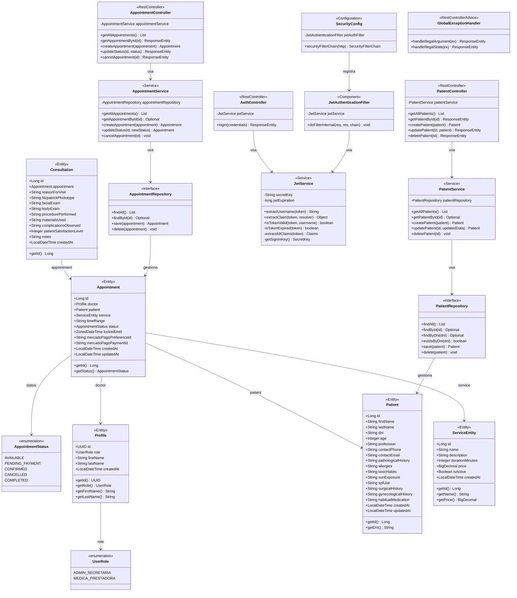

# Modelo de Clases — DermaCare Backend

Sistema de Gestión Dermatológica · Spring Boot 4.1.0 · Java 17

---

## Diagrama de Clases



---

## Relaciones entre entidades

| Desde | Tipo | Hasta | Columna FK | Nulable |
|-------|------|-------|------------|---------|
| `Appointment` | `@ManyToOne` | `Profile` | `doctor_id` | No |
| `Appointment` | `@ManyToOne` | `Patient` | `patient_id` | Sí |
| `Appointment` | `@ManyToOne` | `ServiceEntity` | `service_id` | Sí |
| `Consultation` | `@OneToOne` | `Appointment` | `appointment_id` | No |

---

## Estructura de paquetes

```
com.dermacare.backend
├── controllers/
│   ├── AuthController          POST /api/auth/login
│   ├── PatientController       GET /api/patients · POST /api/patients · GET/PUT/DELETE /api/patients/{id}
│   ├── AppointmentController   GET /api/appointments · GET/POST /api/appointments/{id} · PATCH status · POST cancel
│   └── GlobalExceptionHandler  @RestControllerAdvice (400 Bad Request / 409 Conflict)
├── services/
│   ├── PatientService          lógica de negocio y validación de pacientes
│   └── AppointmentService      lógica de negocio y estados de turnos
├── entities/
│   ├── Patient                 tabla: patients
│   ├── Appointment             tabla: appointments
│   ├── Consultation            tabla: consultations
│   ├── Profile                 tabla: profiles
│   ├── ServiceEntity           tabla: services
│   ├── AppointmentStatus       enum
│   └── UserRole                enum
├── repositories/
│   ├── PatientRepository       JpaRepository<Patient, Long>
│   └── AppointmentRepository   JpaRepository<Appointment, Long>
└── security/
    ├── JwtService              manejo de tokens JWT
    ├── JwtAuthenticationFilter filtro HTTP (OncePerRequestFilter)
    └── SecurityConfig          cadena de seguridad Spring
```

> **Deuda técnica:** `Consultation` y `ServiceEntity` tienen entidad JPA pero no tienen controlador ni repositorio propio todavía.
